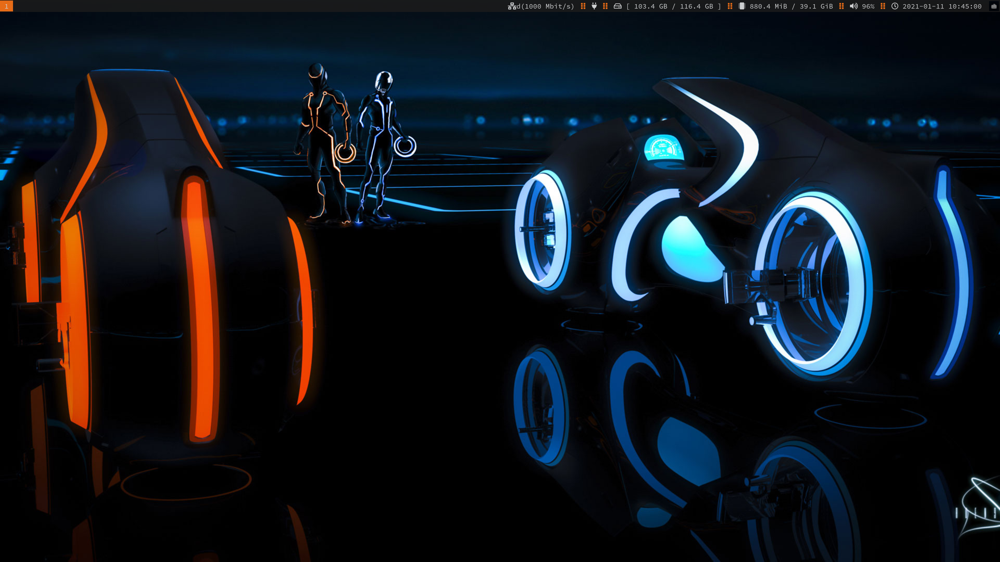
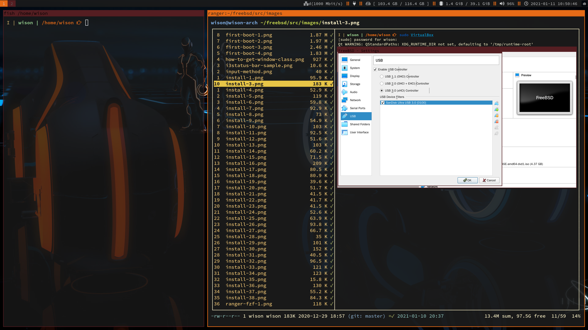

# FreeBSD Installation And Configuration Tutorial

The book is created by **`mdbook`**.

- How to install **`mdBook`**

    Install via cargo:

    ```bash
    cargo install mdBook
    ```

- How to view the book in your browser

  Make sure you're in the repo root folder and run:

    ```bash
    # Clean the prev build
    mdbook clean

    # Serve it via HTTP server
    mdbook serve --open
    ```
It will build the book into `book` folder and open it 
your browser.

How to export the book into **`PDF`** format?

That's pretty easy, in the browser, click on the print icon on the right-top to save as **`PDF`**.

`i3` customization UI preview:



[Full size preview](https://github.com/wisonye/freebsd/blob/master/src/images/preview-3.png)



[Full size preview](https://github.com/wisonye/freebsd/blob/master/src/images/preview-4.png)
