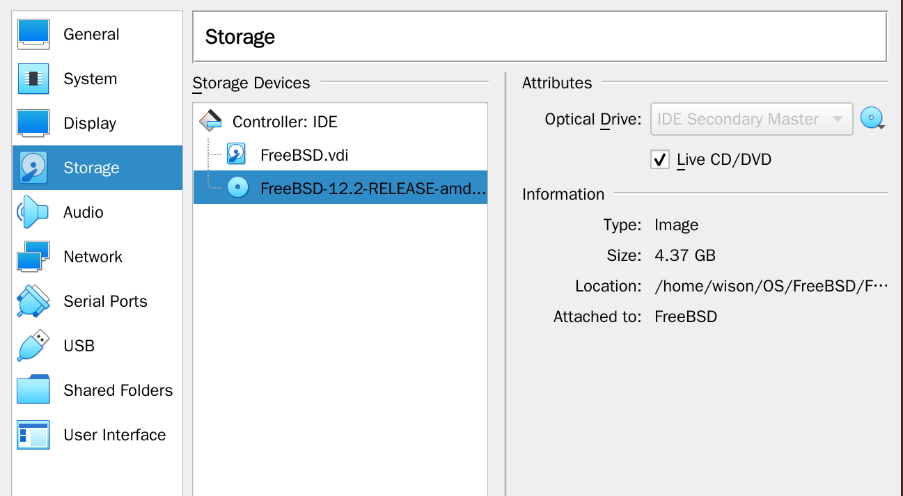
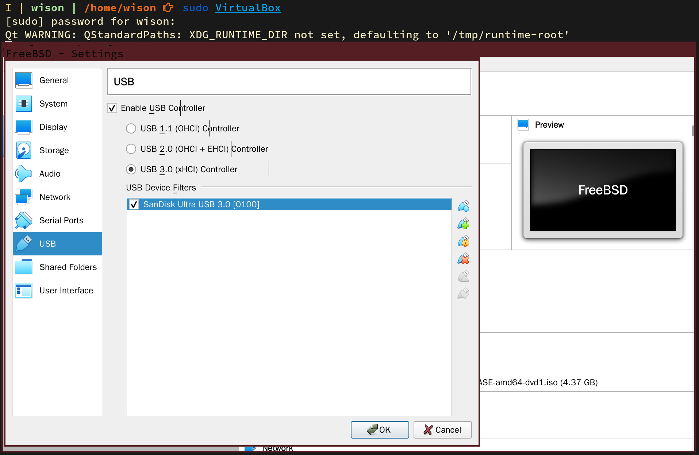

# Before install

Before installing `FreeBSD` to `USB`, you need to prepare a frew things:

- `FreeBSD` boot ISO

    You can goto [here](https://www.freebsd.org/where.html#download) and pick the ISO you want.
    For example, to use [`FreeBSD-12.2-RELEASE-amd64-disc1.iso`](https://download.freebsd.org/ftp/releases/amd64/amd64/ISO-IMAGES/12.2/FreeBSD-12.2-RELEASE-amd64-disc1.iso)
    for this demo.

    [Here](https://www.freebsd.org/doc/en_US.ISO8859-1/books/handbook/bsdinstall-pre.html) is the different between differen type of ISO:

    - **`bootonly.iso`**: This is the smallest installation file as it only contains the installer. A working Internet connection is required during installation as the installer will download the files it needs to complete the FreeBSD installation. This file should be burned to a CD using a CD burning application.

    - **`disc1.iso`**: This file contains all of the files needed to install FreeBSD, its source, and the Ports Collection. It should be burned to a CD using a CD burning application.

    - **`dvd1.iso`**: This file contains all of the files needed to install FreeBSD, its source, and the Ports Collection. It also contains a set of popular binary packages for installing a window manager and some applications so that a complete system can be installed from media without requiring a connection to the Internet. This file should be burned to a DVD using a DVD burning application.

    - **`memstick.img`**: This file contains all of the files needed to install FreeBSD, its source, and the Ports Collection. It should be burned to a USB stick using the instructions below.

    - **` mini-memstick.img`**: Like **`bootonly.iso`**, does not include installation files, but downloads them as needed.
    A working internet connection is required during installation.

 

- You need to run `VirtualBox` with `sudo`, otherwise, you won't be able to see `USB` in the settings UI.

    - Attacth `FreeBSD-12.2-RELEASE-amd64-disc1.iso`

        

    - Add the USB drive you want to installed to 

        
