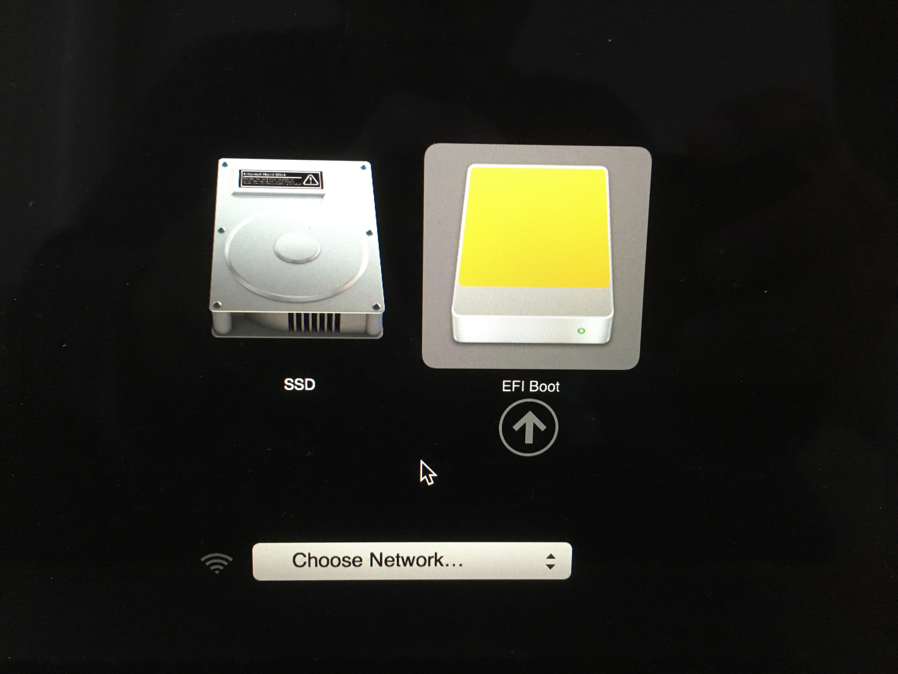
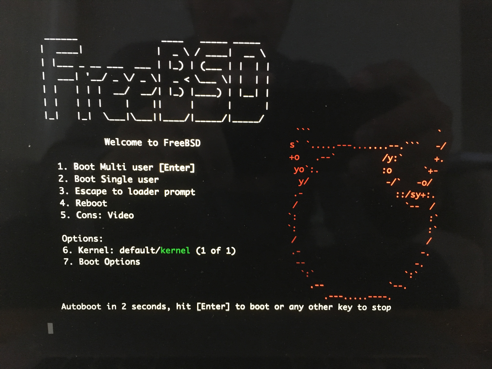
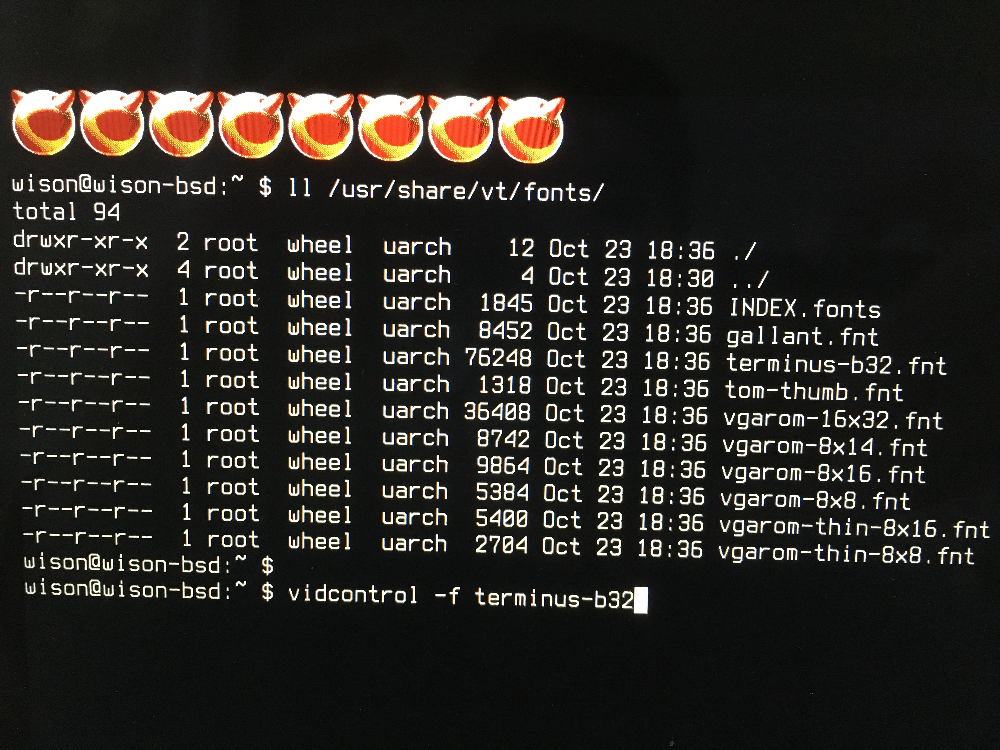

# Extra config after first boot

Reboot via `USB` (hold down the `option` key if you're using apple keyboard), and you will see the boot selection like below:



After a few seconds, you will see the `FreeBSD` bootloader:

</br>



Press `Enter` to boot.

</br>

- Change virtual console font

    After you login, maybe you see the font size is too small to read (especially in `Apple Retina Screen`), then you can change
    the bigger and nice virtual console font like above.

    </br>

    

</br>

- Fixed the network configuration

    Because you installed the `FreeBSD` from `VirtualBox` which used the virutal NIC, so the NIC setting inside `/etc/rc.conf` is
    incorrect. You need to fix by walking through the steps below:

    - First, you need to list what kind of the NIC `FreeBSD` detected by the default driver. Run `ifconfig`, and you
    will get back something like below:

        ```bash
        # The first giga-bit Ethernet interface
        bge0: flags=8843<UP,BROADCAST,RUNNING,SIMPLEX,MULTICAST> metric 0 mtu 1500
                options=c019b<RXCSUM,TXCSUM,VLAN_MTU,VLAN_HWTAGGING,VLAN_HWCSUM, TSO4, VLAN_HWTSO,LINKSTATE>
                ether 00:a0:cc:da:da:da
                inet 192.168.1.88 netmask 0xffffff00 broadcast 192.168.1.255
                media: Ethernet autoselect (1000baseTX <full-duplex>)
                status: active

        # The first Ethernet interface.
        # dc0: flags=8843<UP,BROADCAST,RUNNING,SIMPLEX,MULTICAST> metric 0 mtu 1500
        #         options=80008<VLAN_MTU,LINKSTATE>
        #         ether 00:a0:cc:da:da:da
        #         inet 192.168.1.3 netmask 0xffffff00 broadcast 192.168.1.255
        #         media: Ethernet autoselect (100baseTX <full-duplex>)
        #         status: active

        # The second Ethernet interface.
        # dc1: flags=8802<UP,BROADCAST,RUNNING,SIMPLEX,MULTICAST> metric 0 mtu 1500
        #         options=80008<VLAN_MTU,LINKSTATE>
        #         ether 00:a0:cc:da:da:db
        #         inet 10.0.0.1 netmask 0xffffff00 broadcast 10.0.0.255
        #         media: Ethernet 10baseT/UTP
        #         status: no carrier
        ```

        So, the `bge0` is the correct NIC.

    </br>

    - Fixed the `dhcp` setting in `/etc/rc.conf`

        `vi /etc/rc.conf` and change like below:

        ```bash
        # Incorrect setting
        # ifconfig_em0="DHCP"

        # Correct setting
        ifconfig_bge0="DHCP"
        ```

        Save it and reboot.
    
    </br>

    - Make your first clean snapshot before continue if needed
        
        Because you're using `ZFS` which allows you to take any snapshot at any given time, long story in short
        about the **`snapshot`**: It works like `GIT COMMIT` history, it only records the changed content, NOT 
        just copy the entire folder, that's why making a snapshot is cheap and fast than you thought.

        If you didn't change the `zroot` pool name, then you should run the command below to take the entire
        snapshot for the root dataset:

        ```bash
        zfs snapshot -r zroot@clean_backup
        ```


        For more detail about `ZFS` or `snapshot`, plz read the `ZFS` chapter.

