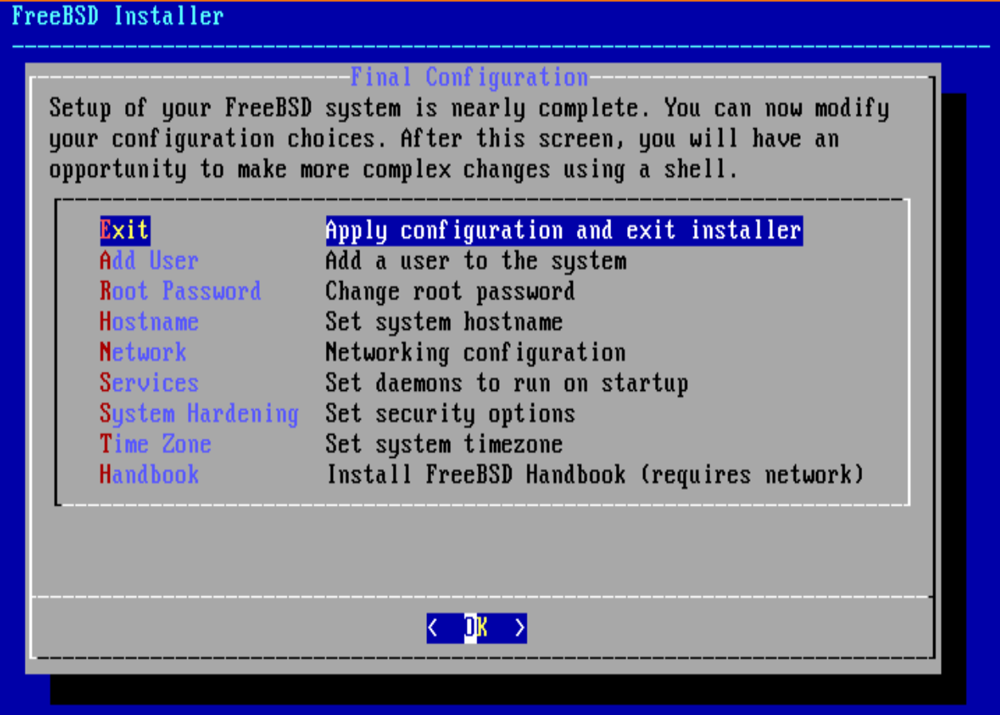

# Install process

Start your `FreeBSD` virtual machine, after booting, press `Enter` and wait for loading,
then you will see this UI:

Press `Install`.

 

Press `Enter` to accept the default keymap (`us`) or choose the you use.

 

Fill your `hostname` and `OK`.

 

Select which components you want to install:

- **`base-dbg`** - Base tools like cat, ls among many others with debug symbols activated.

- **`kernel-dbg`** - Kernel and modules with debug symbols activated.

- **`lib32-dbg`** - Compatibility libraries for running 32-bit applications on a 64-bit version of FreeBSD with debug symbols activated.

- **`lib32`** - Compatibility libraries for running 32-bit applications on a 64-bit version of FreeBSD.

- **`ports`** - The FreeBSD Ports Collection is a collection of files which automates the downloading, compiling and installation of third-party software packages. Chapter 4, Installing Applications: Packages and Ports discusses how to use the Ports Collection.

- **`src`** - The complete FreeBSD source code for both the kernel and the userland. Although not required for the majority of applications, it may be required to build device drivers, kernel modules, or some applications from the Ports Collection. It is also used for developing FreeBSD itself. The full source tree requires 1 GB of disk space and recompiling the entire FreeBSD system requires an additional 5 GB of space.

- **`tests`** - FreeBSD Test Suite. 

Then `Ok`.

 

Choose the file system format you want, I highly recommend you choose `Auto (ZFS)`, as `FreeBSD` support it natively and you got the `snapshot`
feature with zero cost!!!

 

Choose your `USB` drive which should mark as `da0`.

 

A few things here:

- As you're installing `FreeBSD` to `USB`, then you don't need `SWAP` (especially your `USB` drive is `SSD`), make sure set it to `0`.

- For the `Partition Scheme`, use `GPT (UEFI)`!!! I have a bad experinece when I choose `GPT (BIOS + UEFI)` (not sure that's the problem or not).

Then, go to the top one `Pool Type/Disk` and press `Enter` to go to the next settings.

 

Press `Enter` to choose the default `stripe`.

 

Make sure to choose your `USB` drive. It will go back to the prev setting UI.

 

Go to the most top one `Install     Proceed with Installation` and press `Enter`.

 

Press `Enter` to confirm, all data in your `USB` will be wiped.

 

Now, it will fetch all the files.

 

Pay attention:

_This is what happened to me when I choosed `GPT (BIOS + UEFI)`, it will hang on there and you have to reboot the virtual machine and repeat the steps_
_above._

 

After fetching all the files, copying files step will happen.

 

Then, set the new root password.

 

Press `Enter` to accept the default `NIC` (Network Interface Card).

 

Press `Enter` to config `IPv4`.

 

Press `Enter` if you want `dhcp` to be endabled, or choose `No` and add your customized IP settings.

 

Choose `No` if you don't need `IPv6`.

 

If you choosed `dhcp` in the prev step, then it should fill the `DNS` settings automatic. Otherwise, just fill your own settings there.

 

Pick your time zone and `Enter`.

 

Pick your time zone and `Enter`.

 

Just `Skip`, as you will enable `ntpd` service later.

 

Just `Skip`, as you will enable `ntpd` service later.

 

Enable the service you want,  then `Enter`.

 

Choose the right option for you, `clean_tmp` will be useful.

 

Press `Enter` to add new user.

 

Fill everything you needed, make sure to add the new user to the `wheel` group!!!

 

Type `Yes` to confirm.

 

Type `No` if you don't need another user.

 

Press `Enter` to exit the installation process.

 

Installation is done so far, choose `No` if you don't have extra config at this moment.

Then `reboot` and poweroff the virtual manchine.

 

If you run `sudo fdisk -l` right now, you should able to see your `USB` drive has similar partition info like below:

