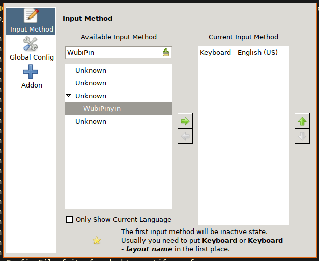

# Support chinese

- Install chinese fonts

    ```bash
    # For Chinese-simplified
    sudo pkg install zh-sourcehansans-sc-otf 

    # For Chinese-traditional
    sudo pkg install zh-sourcehansans-tc-otf 
    ```

    If got problem by installing via `pkg`, then try use the `port`:

    ```bash
    # For Chinese-simplified
    cd /usr/ports/chinese/sourcehansans-sc-otf
    sudo make install clean

    # For Chinese-traditional
    cd /usr/ports/chinese/sourcehansans-tc-otf
    sudo make install clean
    ```

    After that, make sure to clean the **`distfiles**` folder, as it holds
    a lot of disk space:

    ```bash
    sudo rm -rf /usr/ports/distfiles/*
    ```

    Now, relogin to take effect.

</br>

- Install chinese input method

    ```bash
    sudo pkg install zh-fcitx zh-fcitx-table-extra zh-fcitx-configtool
    ```

</br>

- Add input method configuration file

    Put the following settings into `~/.xprofile`:

    ```bash
    export GTK_IM_MODULE=fcitx
    export QT_IM_MODULE=fcitx
    export XMODIFIERS="@im=fcitx"
    ```

</br>

- Auto start `fcitx` in your `i3` configuration

    `vim ~/.config/i3/config` and add the following settings:

    ```bash
    # Load chinese input method
    exec_always fcitx

    # Enable floating mode for the configuration tool UI 
    for_window [class="(?i)fcitx-config-gtk"] floating enable
    ```

    Exit `i3` or relogin to take effect.

</br>

- Open configuration tool and add your input method

    

    Make sure:

    - Click to unselect the `Only Show Current Language`

    - Search the input method you want. For example: `WubuPin` (Wubu + PinYin)

    - Click the `right arrow` to add it to `Current Input Method`

    Exit `i3` or relogin to take effect.
