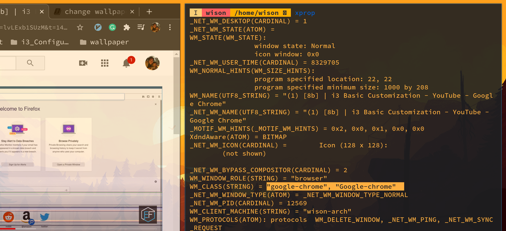

# window customization

- How to get the `Window Class`

    Open the (application) window you want to get the class string name, and then
    open your terminal app side by side, then run `xprop`.

    Right now, you can see the cursor become a `cross`, then click on the window,
    then you will get the result like below:


    

    The highlight part is the `window class` string value, you can pick any one of them
    and assign to the `i3` configuration file to apply the window customization:

    ```bash
    for_window [class="(?i)google-chrome"] border pixel 1
    # for_window [class="Skype"] floating enable border normal
    # for_window [class="(?i)virtualbox"] floating enable border normal
    ```

</br>

- Apply color setting to window
    
    Replace all colors you want and reload `i3` to take effect.

    ```bash
    # Window colors
    set $bg_color           #E66B17
    set $ibg_color          #551E22
    set $border_color       #E66B17
    set $text_color         #FFFFFF
    set $itext_color        #000000
    set $ubg_color          #000000
    
    #                       border          background          text            indicator
    client.focused          $border_color   $bg_color           $text_color     $bg_color
    client.focused_inactive $ibg_color      $ibg_color          $itext_color    $ibg_color
    client.unfocused        $ibg_color      $ibg_color          $itext_color    $ibg_color
    client.urgent           $ubg_color      $ubg_color          $text_color     $ubg_color
    # client.placeholder      #000000 #0c0c0c #ffffff #000000   #0c0c0c
    ```
