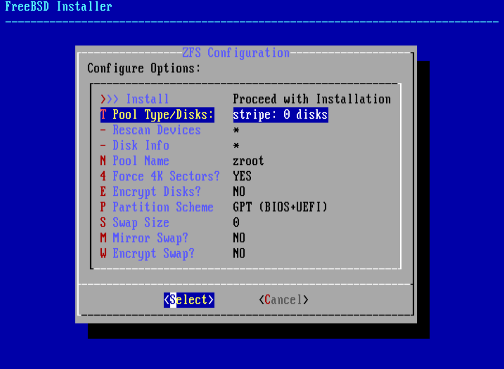

# ZFS

The `Z File System`, or `ZFS`, is an advanced file system designed to overcome 
many of the major problems found in previous designs. `ZFS` can Self-Healing 
automatic.

Originally developed at Sun™, ongoing open source `ZFS` development has moved to
the **`OpenZFS`** Project.

- Enable `ZFS`

    `sudo vim /etc/rc.conf` with the following settings:

    ```bash
    zfs_enable="YES"
    ```

    Or you can turn it on manually by running: 

    ```bash
    sudo service zfs start
    ```

</br>

- What is `zpool`?

    Surmise, `ZFS` concept just like the Logical Volume you know: `ZFS` can add one 
    or more disks(even disk partitions) into a `Single share disk space` which call 
    **`pool`**.

    By default, when you install the **`FreeBSD`** like the settings below:

    

    It similar to run this command to create a single disk pool:

    ```bash
    # `SCSI` disks with the device names `da0`, `da1`, and `da2`. 
    # Users of `SATA` hardware should instead use `ada` device names.
    zpool create zroot /dev/da0
    ```

    </br>

    After installation, it will end up with `zroot` pool like this:

    ```bash
    zpool list
    #NAME    SIZE  ALLOC   FREE  CKPOINT  EXPANDSZ   FRAG    CAP  DEDUP    HEALTH  ALTROOT
    #zroot   238G  5.87G   232G        -         -     0%     2%  1.00x    ONLINE  -

    zpool status
    #   pool: zroot
    #  state: ONLINE
    # config:
    # 
    # 	NAME        STATE     READ WRITE CKSUM
    # 	zroot       ONLINE       0     0     0
    # 	  ada0p2    ONLINE       0     0     0
    # 
    # errors: No known data errors
    ```

</br>

- What is `Dataset`?

    A `zpool` just the total available disk space from one or more disks, 
    that's it, nothing else. That means it does NOT contain any `File System`
    at all, you need to create `Dataset` to hold the `File System` and mount
    it to the particular folder to store files!!!

    So, that's the relationship: `Pool --> Dataset --> Folder/Files`

    After the default `auto ZFS` installation, it similar to you run the commands
    below to create multiple `Dataset` and mount to specified folders:

    ```bash
    zfs create -o mountpoint=none zroot/ROOT
    zfs create -o mountpoint=/ zroot/ROOT/default

    zfs create -o mountpoint=/tmp zroot/tmp

    zfs create -o mountpoint=/usr zroot/usr
    zfs create -o mountpoint=/usr/home zroot/usr/home
    zfs create -o mountpoint=/usr/ports zroot/usr/ports
    zfs create -o mountpoint=/usr/src zroot/usr/src

    zfs create -o mountpoint=/var zroot/var
    zfs create -o mountpoint=/var/audit zroot/var/audit
    zfs create -o mountpoint=/var/crash zroot/var/crash
    zfs create -o mountpoint=/var/log zroot/var/log
    zfs create -o mountpoint=/var/mail zroot/var/mail
    zfs create -o mountpoint=/var/tmp zroot/var/tmp
    ```

    So, it will end up with the `Datasets` like below:

    ```bash
    zfs list

    NAME                 USED  AVAIL     REFER  MOUNTPOINT
    # zroot               5.87G   225G       96K  /zroot
    # zroot/ROOT          2.70G   225G       96K  none
    # zroot/ROOT/default  2.70G   225G     2.68G  /
    # zroot/tmp           3.30M   225G     3.13M  /tmp
    # zroot/usr           3.17G   225G       96K  /usr
    # zroot/usr/home      1.73G   225G     1.70G  /usr/home
    # zroot/usr/ports      778M   225G      732M  /usr/ports
    # zroot/usr/src        688M   225G      688M  /usr/src
    # zroot/var           1.34M   225G       96K  /var
    # zroot/var/audit       96K   225G       96K  /var/audit
    # zroot/var/crash       96K   225G       96K  /var/crash
    # zroot/var/log        608K   225G      348K  /var/log
    # zroot/var/mail       304K   225G      128K  /var/mail
    # zroot/var/tmp        168K   225G       96K  /var/tmp
    ```

    You're able to add any `Dataset` at any time you want. And destroy a 
    `mounted Dataset` is more faster than you delete a folder (inclues all
    files inside that folder), as it doesn't need to do checking, just
    remove a part of the disk space, that's it.

    ```bash
    # Create a dataset call `my-data` with the specified mount
    # point. If you don't add the `-o mountpoint` attribute there,
    # It will be created and mounted in `/zroot/my-data`!!!
    sudo zfs create -o mountpoint=/usr/home/$USER/my-data zroot/my-data

    # Change the mounted folder owner
    sudo chown -R $USER:$USER ~/my-data

    # Write or access 
    echo "test" > ~/my-data/test.log

    # Destroy the entire dataset, it won't delete mounted folder
    sudo zfs destroy zroot/my-data

    # Remove the empty folder if needed
    rm -rf ~/my-data
    ```
